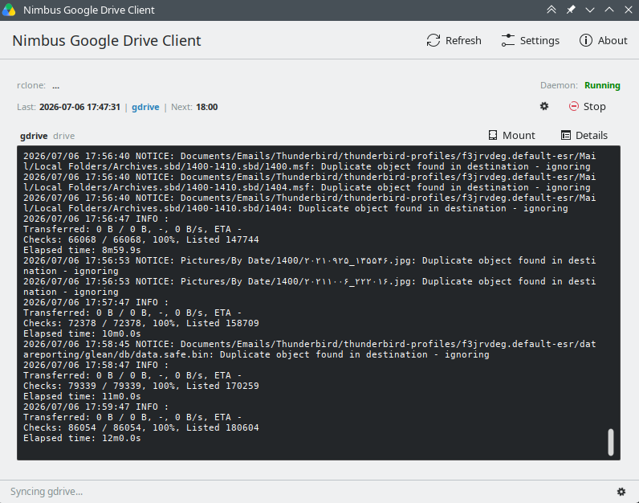
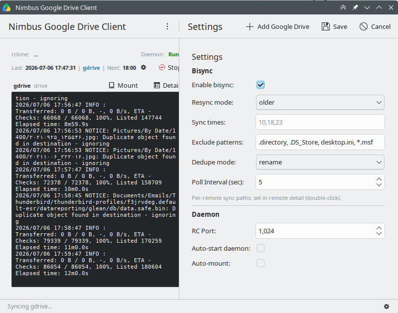
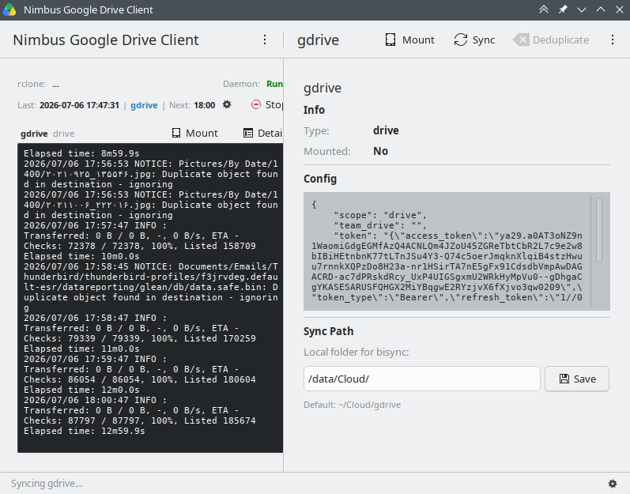

# Nimbus Google Drive Client

A stable, fast **Google Drive client** built on top of
[`rclone`](https://rclone.org) as its sync/mount engine.

Unlike KDE's official `kio-gdrive` (which is a thin Drive-API browser over KIO,
with no offline files and no real sync), Nimbus runs a long-lived
`rclone rcd` (Remote Control) daemon under the hood and controls it through its
HTTP JSON-RPC API. This gives you:

- **Fast** — persistent VFS cache, connection pooling, and chunked reads survive
  across operations (no cold start per request).
- **Stable** — a structured, versioned RC API with a job/progress model instead
  of fragile stdout parsing; health-checked mounts with auto-restart.
- **Native KDE** — Qt6 + KDE Frameworks 6 + Kirigami, a Plasma system-tray icon
  (`KStatusNotifierItem`), single-instance via `KDBusService`.

> Work in progress. The initial release is an **MVP**: a system-tray app that
> FUSE-mounts/unmounts Google Drive and walks the user through OAuth setup.
> Two-way sync and an in-app file browser are planned for later phases.

---

## Requirements

### Runtime
- `rclone` (System binary; install via your distribution's package manager)
- FUSE support (`fuse3` and `/dev/fuse`)
- A Google Drive account

### Build
- CMake ≥ 3.24
- ECM (extra-cmake-modules) — KF6
- Qt6: `Core`, `Gui`, `Network`, `Qml`, `Quick`, `QuickControls2`
- KDE Frameworks 6: `kirigami`, `ki18n`, `kcoreaddons`, `kconfig`, `kdbusaddons`, `kstatusnotifieritem`

Example installation on Arch Linux:

```bash
sudo pacman -S base-devel cmake extra-cmake-modules \
  qt6-base qt6-declarative qt6-quickcontrols2 \
  kirigami ki18n kcoreaddons kconfig kdbusaddons kstatusnotifieritem \
  rclone fuse3
```

---

## Build & Run

### 1. Install Requirements

**Ubuntu / Debian:**
```bash
sudo apt install cmake g++ extra-cmake-modules qt6-base-dev qt6-declarative-dev \
  libkirigami-dev libkf6coreaddons-dev libkf6i18n-dev libkf6config-dev \
  libkf6dbusaddons-dev libkf6statusnotifieritem-dev rclone fuse3
```

**Arch Linux:**
```bash
sudo pacman -S base-devel cmake extra-cmake-modules \
  qt6-base qt6-declarative qt6-quickcontrols2 \
  kirigami ki18n kcoreaddons kconfig kdbusaddons kstatusnotifieritem \
  rclone fuse3
```

### 2. Build

```bash
# From project root
cmake -B build -DCMAKE_BUILD_TYPE=Release
cmake --build build
```

### 3. Run

```bash
./build/src/nimbus-gdrive
```

Or system install:
```bash
sudo cmake --install build
nimbus-gdrive
```

---

## Screenshots

<div align="center">
  <h3>Main Window & Active Sync</h3>
  

  <h3>Advanced Settings</h3>
  

  <h3>Cloud Remote Details</h3>
  
</div>

---

## License

GPL-3.0-or-later. See [LICENSE](LICENSE).
